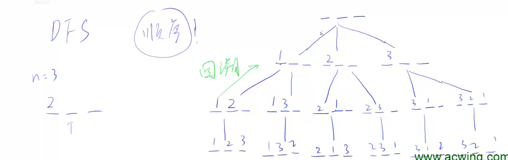

# 深度优先搜索：



#include <iostream>

using namespace std;

const int N = 10;

int n, path[N];
bool st[N];

void dfs(int u)
{
    if(u == n) 
    {
        for(int i = 0; i < n; i++) cout << path[i] << ' ';
        cout << endl;
    }

```
for(int i = 1; i <= n; i++)
{
    if(!st[i])
    {
        path[u] = i;
        st[i] = true;
        dfs(u+1);
        st[i] = false;
    }
}
```

}
