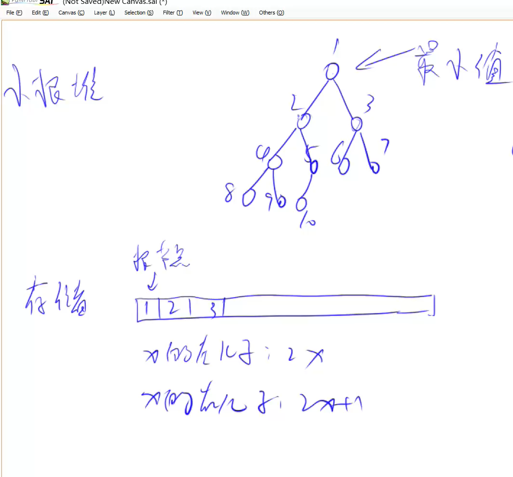

# 堆

## 如何手写一个堆？

 

1.插入一个数

2.求集合当中最小值

3.删除最小值

4.删除任意一个元素

5.修改任意一个元素

1. 插入一个数： heap[++size] = x; up(size);
2. 求集合当中最小值：heap[1]
3. 删除最小值：heap[1] = heap[szie]; size--; down(1)
4. 删除任意一个元素：heap[k] = heap[size]; size--; down(k); up(k)
5. 修改任意一个元素：heap[k] = x; down(k); up(k);
